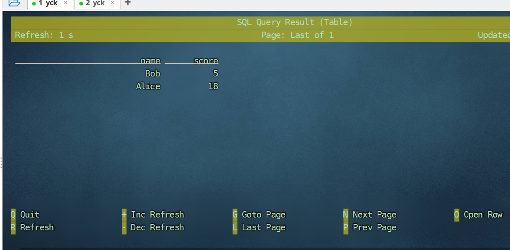
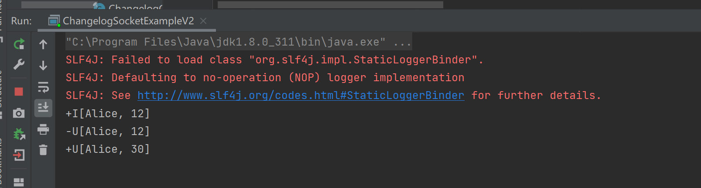

# flink-sql-connector-mysocket
Copy socket connector sql from Apache Flink [code](https://github.com/apache/flink/blob/master/flink-examples/flink-examples-table/src/main/java/org/apache/flink/table/examples/java/connectors/SocketDynamicTableFactory.java).
For more details please take a look at [Full Stack Example](https://nightlies.apache.org/flink/flink-docs-master/docs/dev/table/sourcessinks/#full-stack-example)

## Run in Flink SQL SHELL
1. Copy the flink-sql-connector-mysocket-1.0-SNAPSHOT.jar to the `lib/` of flink.
2. Start the flink standalone cluster by using command `./bin/start-cluster.sh`.
3. Open Flink SQL SHELL by using command `./bin/sql-client.sh`
4. Copy the code below to your Flink SQL Shell. For more details please see the [official Flink documentation](https://nightlies.apache.org/flink/flink-docs-master/docs/dev/table/sourcessinks/#full-stack-example)
```shell
CREATE TABLE UserScores (name STRING, score INT)
WITH (
'connector' = 'socketv2',
'hostname' = 'localhost',
'port' = '9999',
'byte-delimiter' = '10',
'format' = 'changelog-csv-v2',
'changelog-csv-v2.column-delimiter' = '|'
);

select * from UserScores;
```
```shell

> nc -lk 9999
INSERT|Alice|12
INSERT|Bob|5
DELETE|Alice|12
```
5. If You don't miss anything, you will see the following result like the below image:


## Run in the IDEA
1. Run the class `src/main/java/com/github/yck/connector/socket2/ChangelogSocketExampleV2.java`, remember add `Add dependencies with 'provided' scope to classpath` in your IDEA.
2. If You don't miss anything, you will see the following result like the below image:
