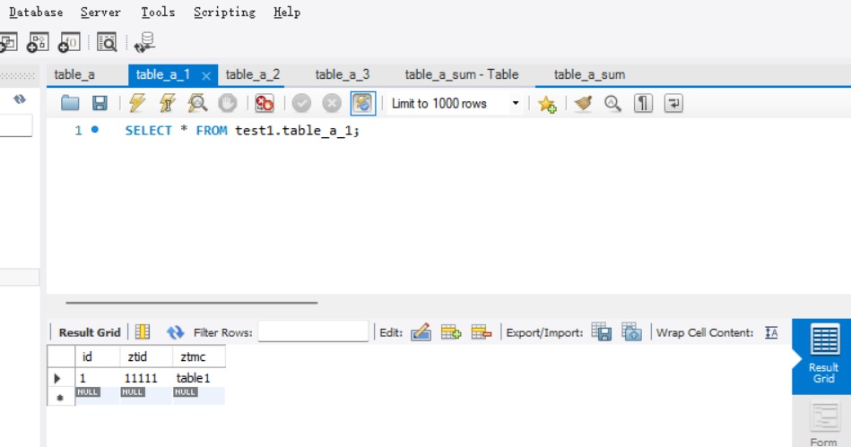
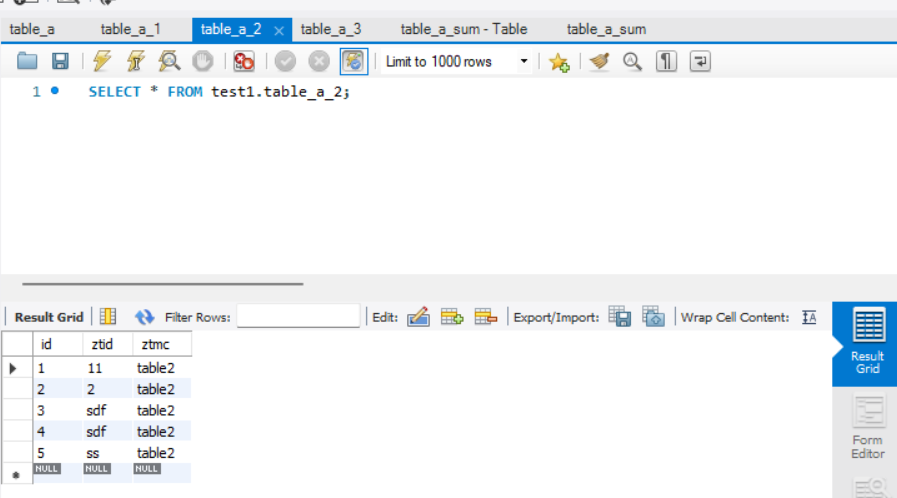
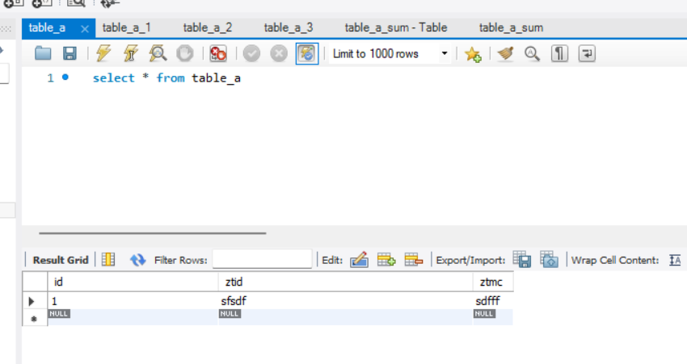
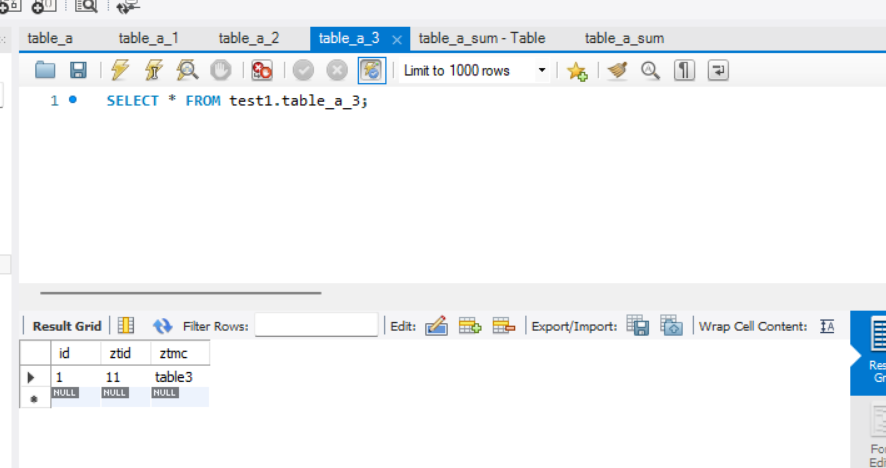
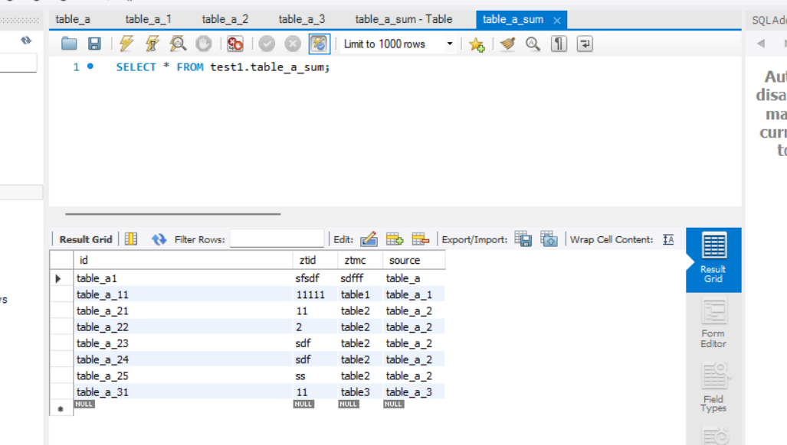
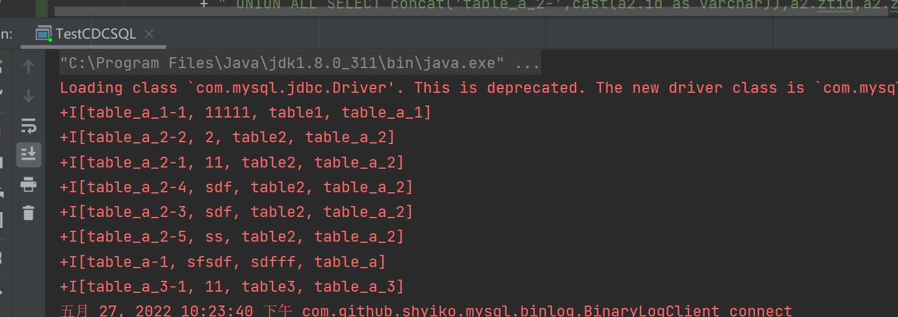
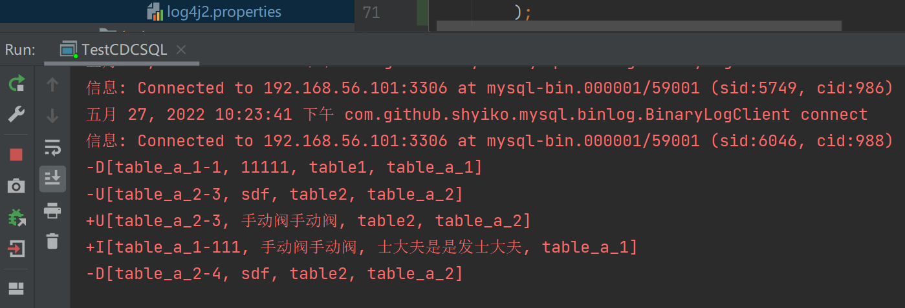
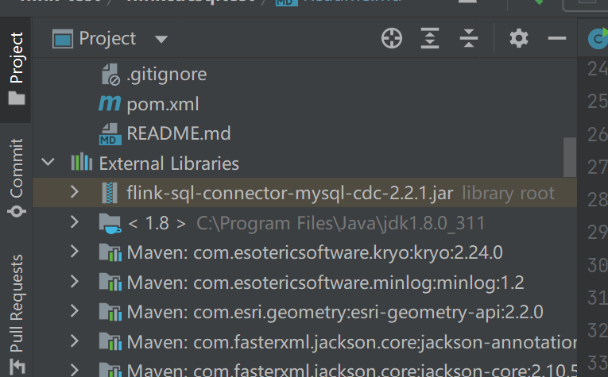

初步测试 Flink 支持分库分表合并到一张表内。

运行效果图：
四个mysql的分库分表数据如下：

写入同一张表如下：

同时，命令行CURD行为如下：


其他
1. Mysql测试数据在 mysql 文件下
2. Mysql的/etc/my.cnf
需要增加如下配置
```text
[mysqld]
#
# Remove leading # and set to the amount of RAM for the most important data
# cache in MySQL. Start at 70% of total RAM for dedicated server, else 10%.
# innodb_buffer_pool_size = 128M

log_bin=mysql-bin
binlog-format=ROW
server-id=1


```

主方法：
src/main/java/com/yck/TestCDCSQLShardingTest.java
主要的jar包 
flink-sql-connector-mysql-cdc-2.x.jar
还没有发布到maven仓库中，可下载jar包，放入 Idea 的依赖中。



flink-sql-connector-mysql-cdc-2.3-SNAPSHOT.jar
https://ververica.github.io/flink-cdc-connectors/master/content/%E5%BF%AB%E9%80%9F%E4%B8%8A%E6%89%8B/mysql-postgres-tutorial-zh.html#flink